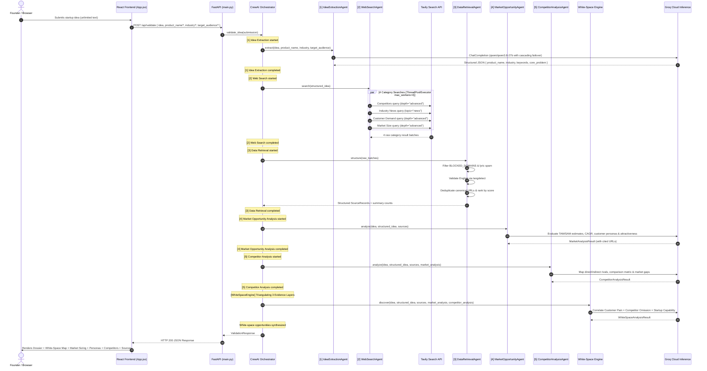

# System Architecture — Startup Idea Validator (Milestone 2)

## 1. Executive Summary & Overview

The **Startup Idea Validator** is an autonomous multi-agent research platform designed to evaluate early-stage startup concepts against real-time market data. The platform transforms natural language startup pitches of arbitrary length into structured intelligence across market opportunity sizing, customer persona segmentation, competitive positioning matrices, and defensible white-space opportunity maps.

Milestone 2 delivers:
- **Frontend**: A fast, responsive editorial Single Page Application built with **React 18 + Vite** (Vanilla CSS) featuring:
  - Natural language submission with **Zero artificial character limit**.
  - Interactive **Evidence-Backed Market White-Space Map** displaying 4-vector triangulation.
  - **Market Opportunity & Sizing** scorecard with cited TAM/SAM and CAGR figures.
  - **Granular Customer Segmentation** cards contrasting End Users vs. Decision Makers.
  - **Competitor Discovery & Comparison Matrix** evaluating direct rivals and indirect substitutes.
  - **Sanitized Source Evidence Grid** with sentence-boundary truncation and relevance scoring.
- **Backend API**: A high-performance REST service built with **FastAPI (Python 3.12)**.
- **CrewAI Orchestration Layer**: Sequential multi-agent workflow using CrewAI concepts (`Agent`, `Task`, `Crew`, `Process.sequential`) with strict step-by-step progress logging.
- **5 Autonomous Research & Intelligence Agents**:
  1. `IdeaExtractionAgent`: Extracts domain semantics, industry vertical, audience profile, core problem statement, and contextual keywords using Groq LLMs with cascading failover.
  2. `WebSearchAgent`: AI-native search coordinator querying the **Tavily Search API** in parallel across 4 market categories.
  3. `DataRetrievalAgent`: Sanitization and verification engine filtering blocked domains, verifying English language, deduplicating URLs, and computing relevance metrics.
  4. `MarketOpportunityAgent`: Analyzes empirical search data to produce market size estimates (global/regional/niche), CAGR growth drivers, customer personas, and market attractiveness scorecards without hallucinating numbers.
  5. `CompetitorAnalysisAgent`: Discovers direct, indirect, and emerging competitors, maps feature comparisons, and identifies pricing/business-model voids.
- **Evidence-Backed Market White-Space Engine**: Proprietary novelty mechanism triangulating Customer Pain, Competitor Omissions, and Startup Capabilities into high-conviction opportunity gaps with traceable source citations.

---

## 2. End-to-End System Architecture

```
┌─────────────────────────────────────────────────────────────────────────────────────────────────────────┐
│                                       Client Presentation Tier (React 18 + Vite)                        │
│   - Natural language submission (Unlimited Input Length)                                                │
│   - AI Domain Extraction dossier card with case-file badge                                              │
│   - Evidence-Backed Market White-Space Engine (4-Vector Strategy Flow)                                  │
│   - Market Opportunity & Sizing Scorecard (TAM/SAM, CAGR, Attractiveness)                               │
│   - Customer Segmentation (End Users vs Decision Makers, Pain Points, Buying Behavior)                  │
│   - Competitor Comparison Matrix (Direct, Indirect, Emerging Rivals)                                    │
│   - 4-Category Supporting Source Evidence Grid (Tavily Native Relevance)                                │
└────────────────────────────────────────────────────┬────────────────────────────────────────────────────┘
                                                     │
                                                     │ HTTP POST /api/validate (JSON)
                                                     ▼
┌─────────────────────────────────────────────────────────────────────────────────────────────────────────┐
│                                           FastAPI Gateway Layer                                         │
│                                             (backend/main.py)                                           │
│   1. English Coherence & Gibberish Filter (`is_valid_idea` via wordfreq >= 0.45)                        │
│   2. Invokes ValidationCrewOrchestrator                                                                 │
│   3. Serializes Pydantic ValidationResponse                                                             │
└────────────────────────────────────────────────────┬────────────────────────────────────────────────────┘
                                                     │
                                                     ▼
┌─────────────────────────────────────────────────────────────────────────────────────────────────────────┐
│                                  CrewAI Sequential Orchestrator Layer                                   │
│                                    (backend/crew/orchestrator.py)                                       │
│                                                                                                         │
│   [1] Idea Extraction Agent       ──> Extracts product_name, vertical, audience, core_problem, keywords │
│              ↓                                                                                          │
│   [2] Web Search Agent            ──> Dispatches 4 parallel Tavily queries (ThreadPoolExecutor)         │
│              ↓                                                                                          │
│   [3] Data Retrieval Agent        ──> Domain blocklist, langdetect English check, deduplication, ranks  │
│              ↓                                                                                          │
│   [4] Market Opportunity Agent    ──> Market sizing (global/regional/niche), CAGR, customer personas    │
│              ↓                                                                                          │
│   [5] Competitor Analysis Agent   ──> Direct/indirect/emerging rivals, comparison matrix, market gaps    │
│              ↓                                                                                          │
│   Evidence-Backed White-Space Engine ──> Customer Pain ∩ Competitor Weakness ∩ Startup Fit             │
│              ↓                                                                                          │
│   Structured Validation Response (JSON)                                                                 │
└─────────────────────────────────────────────────────────────────────────────────────────────────────────┘
```

---

## 3. Multi-Agent Pipeline & Data Handoffs



---

## 4. Proprietary Novelty: Evidence-Backed Market White-Space Engine

The **Evidence-Backed Market White-Space Engine** addresses the core challenge of startup validation: founders do not just need to know if a market is large; they need to know **where specifically the opportunity exists and why the evidence proves competitors have left it open**.

### The 4-Stage Triangulation Vector:
$$\text{White-Space Gap} = \text{Empirical Customer Pain} \cap \text{Competitor Weakness / Void} \cap \text{Startup Capability}$$

```
[VECTOR 1: CUSTOMER PAIN]
Empirical pain points and demand signals extracted from customer reviews and demand search sources.
          ↓
[VECTOR 2: COMPETITOR OMISSIONS]
Unaddressed feature gaps, high enterprise pricing barriers, and documented customer complaints from competitor research.
          ↓
[VECTOR 3: DISCOVERED MARKET GAP]
Precise structural market void left open by incumbents.
          ↓
[VECTOR 4: STARTUP FIT & DIFFERENTIATION]
Specific architectural or operational mechanism of the proposed startup that solves the gap, backed by a testable differentiation hypothesis and traceable citations.
```

---

## 5. Strict Anti-Hallucination & Reliability Architecture

1. **Grounded Sizing Metrics**: Every quantitative market estimate must cite the source URL and snippet where the figure was retrieved.
2. **Conflicting Evidence Transparency**: When research sources disagree (e.g. diverging TAM estimates), the disparity is explicitly documented in the output rather than inventing an artificial average.
3. **Disclosed vs. Undisclosed Pricing**: Competitor pricing and business models not present in search sources are strictly designated as `"not disclosed in sources"` rather than fabricated.
4. **Cascading Model Failover**: Groq LLM inference utilizes a cascading priority queue (`qwen/qwen3.8-27b` $\rightarrow$ `openai/gpt-oss-120b` $\rightarrow$ `openai/gpt-oss-20b` $\rightarrow$ `allam-2-7b` $\rightarrow$ `groq/compound` $\rightarrow$ `groq/compound-mini`) with exponential backoff on HTTP 429.
5. **Partial-Failure Fault Tolerance**: If an upstream search or LLM agent returns partial data, downstream agents gracefully preserve all available context and synthesize structured fallback findings without crashing the API.

---

## 6. Data Contracts & Pydantic Schemas

### `POST /api/validate` Request Contract: `IdeaSubmission`
```python
class IdeaSubmission(BaseModel):
    idea: str = Field(..., min_length=3, description="Startup description (arbitrary length).")
    product_name: Optional[str] = Field(default=None)
    industry: Optional[str] = Field(default=None)
    target_audience: Optional[str] = Field(default=None)
```

### Full Response Contract: `ValidationResponse`
```python
class ValidationResponse(BaseModel):
    idea: str
    extracted_data: Optional[Dict[str, Any]]
    sources: List[SourceRecord]
    market_analysis: Optional[MarketAnalysisResult]
    competitor_analysis: Optional[CompetitorAnalysisResult]
    white_space_analysis: Optional[WhiteSpaceAnalysisResult]
    summary: Dict[str, Any]
```

---

## 7. Verification & Automated Test Suite

- **Unit & Regression Suite**: `python backend/tests/test_agents.py` and `python backend/tests/test_milestone2.py`
- **3-Industry End-to-End Benchmark Suite**: `python backend/scripts/test_milestone2_e2e.py`
  - **Test 1 — Healthcare**: Clinic patient no-show predictor with scheduling interventions (`ClinicGuard AI`).
  - **Test 2 — Climate / Agriculture**: Smallholder farmer decision platform combining weather, soil, crop data, and market pricing (`FarmOptima`).
  - **Test 3 — Fintech / Education**: University student financial literacy platform connecting spending data to budgeting guidance (`CampusFin`).
