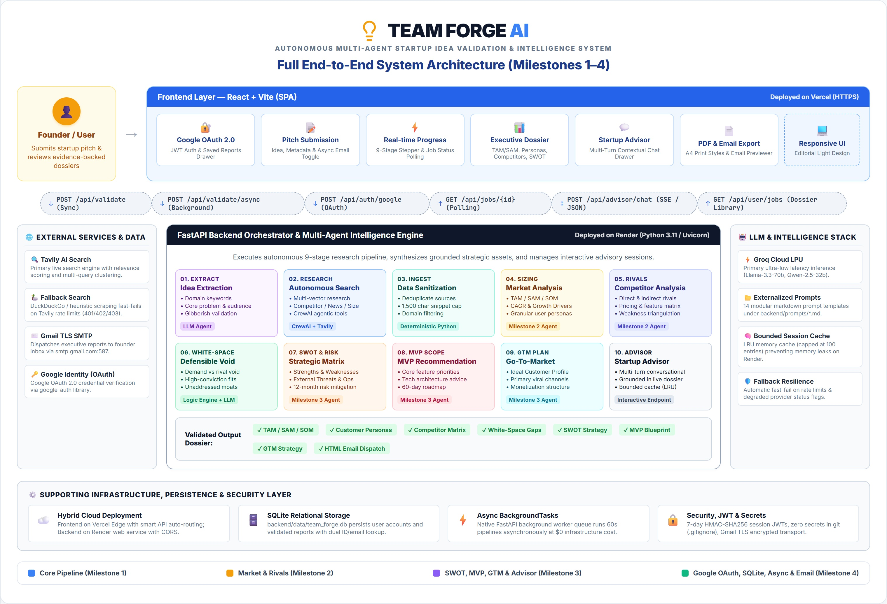
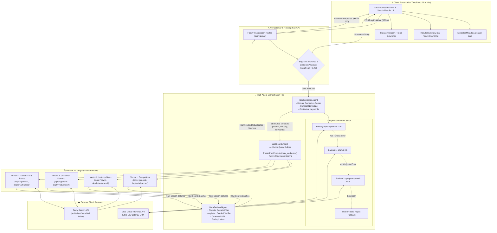
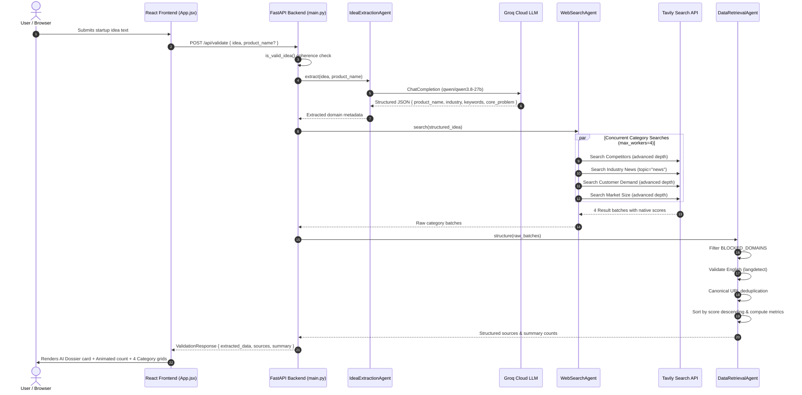

# 🏛️ System Architecture Document — Startup Idea Research Engine (Milestone 1)

## 1. Executive Summary & System Overview

The **Startup Idea Validator** platform is an autonomous multi-agent research engine that transforms unstructured early-stage startup ideas into structured market intelligence. 

Founders and product teams frequently struggle with subjective bias and tedious manual research when evaluating new concepts. The platform automates the critical first phase of market validation by:
1. **Structuring Idea Semantics:** Using LLM reasoning to infer product identity, domain vertical, audience profile, core customer pain points, and contextual keywords from natural language descriptions.
2. **Executing Multi-Dimensional Market Research:** Orchestrating targeted web searches across four distinct strategic vectors:
   - **Competitors & Alternatives:** Surfacing direct rivals, incumbent platforms, and substitute solutions.
   - **Industry News & Trends:** Tracking fresh market dynamics, regulatory shifts, and recent startup activity.
   - **Customer Demand & Problem Signals:** Gathering real-world pain points, feature requests, and user dissatisfaction signals.
   - **Market Size & Growth Forecasts:** Extracting CAGR metrics, total addressable market (TAM) valuations, and analyst projections.
3. **Filtering & Presentation:** Cleansing raw content, deduplicating records, verifying language coherence, and presenting the evidence via a responsive editorial user interface.

---

## 2. End-to-End System Architecture



### 2.1 Multi-Tier Topology & Component Diagram



### 2.2 Sequence & Data Flow Diagram



### 2.3 Detailed ASCII Flow Matrix
                                 ┌─────────────────────────────────────────┐
                                 │          Client Browser (SPA)           │
                                 │     React 18 + Vite (Vanilla CSS)       │
                                 │   - Natural language submission form    │
                                 │   - Stamped AI Dossier metadata view    │
                                 │   - 4-category evidence source cards    │
                                 └────────────────────┬────────────────────┘
                                                      │
                                                      │ HTTP POST /api/validate
                                                      ▼
┌────────────────────────────────────────────────────────────────────────────────────────────────────────────────────────┐
│                                              FastAPI Application Layer                                                 │
│                                                (backend/main.py)                                                       │
│                                                                                                                        │
│  1. Input Validation & Gibberish Filter:                                                                               │
│     - Verifies minimum length (>= 5 chars) and dictionary word ratio (wordfreq >= 0.45)                                │
│     - Fast-fails non-English nonsense strings with 200 OK + explanatory UX guidance                                   │
└─────────────────────────────────────────┬──────────────────────────────────────────────────────────────────────────────┘
                                          │
                                          │ Raw Idea Text + Optional Fields
                                          ▼
┌────────────────────────────────────────────────────────────────────────────────────────────────────────────────────────┐
│                                       1. IdeaExtractionAgent (Groq LLM)                                                │
│                                   (backend/agents/idea_extraction_agent.py)                                            │
│                                                                                                                        │
│  - Executes prompt extraction using high-speed Groq Inference API                                                      │
│  - Multi-Model Failover: Primary (`qwen/qwen3.8-27b`) -> Backup 1 (`allam-2-7b`) -> Backup 2 (`groq/compound-mini`)    │
│  - Exponential backoff on HTTP 429 rate limit triggers (2^attempt delay)                                               │
│  - Deterministic Fallback: Multi-pass regex & opener-stripping fallback parser if LLM endpoint fails                   │
│                                                                                                                        │
│  Outputs Structured JSON:                                                                                              │
│  { product_name, industry, target_audience, core_problem, keywords: [3-5 domain terms] }                               │
└─────────────────────────────────────────┬──────────────────────────────────────────────────────────────────────────────┘
                                          │
                                          │ Structured Metadata
                                          ▼
┌────────────────────────────────────────────────────────────────────────────────────────────────────────────────────────┐
│                                         2. WebSearchAgent (Tavily API)                                                 │
│                                     (backend/agents/web_search_agent.py)                                               │
│                                                                                                                        │
│  - Query Construction Engine: Synthesizes 4 distinct search queries tailored to research dimensions                    │
│  - Parallel Search Execution: ThreadPoolExecutor(max_workers=4) executes category queries simultaneously               │
│  - Tavily Search Parameters: search_depth="advanced", max_results=6 per category                                       │
│  - Topic Routing: Uses topic="news" for Industry News; topic="general" for Competitors, Demand, Market Size            │
│  - Calibrated Native Scoring: Preserves Tavily native relevance scores (0.0 to 1.0) on every item                      │
└─────────────────────────────────────────┬──────────────────────────────────────────────────────────────────────────────┘
                                          │
                                          │ Raw Result Batches (JSON)
                                          ▼
┌────────────────────────────────────────────────────────────────────────────────────────────────────────────────────────┐
│                                           3. DataRetrievalAgent                                                        │
│                                   (backend/agents/data_retrieval_agent.py)                                             │
│                                                                                                                        │
│  - Normalization: Maps results into canonical SourceRecord schemas                                                     │
│  - Blocklist Enforcement: Strips encyclopedia, dictionary, and aggregator domains via BLOCKED_DOMAINS                  │
│  - Language Validation: Validates English text via langdetect (seeds deterministic detector)                           │
│  - Canonical Deduplication: Drops duplicate URLs across queries and category boundaries                                │
│  - Sorting & Aggregation: Sorts records descending by relevance score; aggregates category statistics                  │
└─────────────────────────────────────────┬──────────────────────────────────────────────────────────────────────────────┘
                                          │
                                          │ ValidationResponse (JSON)
                                          ▼
┌────────────────────────────────────────────────────────────────────────────────────────────────────────────────────────┐
│                                       Frontend Presentation Layer (React)                                              │
│                                                                                                                        │
│  - ExtractedMetadata.jsx: Stamped case-file dossier card showing inferred metadata & keyword chips                     │
│  - ResultsSummary.jsx: Smooth count-up counter showing total sources surfaced across the 4 dimensions                  │
│  - CategorySection.jsx & SourceCard.jsx:                                                                               │
│      * Snippet Sanitizer: Strips markdown symbols, pipe tables, link wrappers                                          │
│      * Sentence Truncator: Truncates to ~180-220 chars at clean sentence boundary with "Read more" toggle             │
│      * Equal-Height Grid: Flexbox layout with pinned source domains and relevance percentages                          │
└────────────────────────────────────────────────────────────────────────────────────────────────────────────────────────┘
```

---

## 3. Detailed Component Specifications

### 3.1 `IdeaExtractionAgent`
- **Location:** `backend/agents/idea_extraction_agent.py`
- **Role:** Transforms conversational, ambiguous, or brief startup descriptions into unambiguous research parameters.
- **Why LLM Extraction is Critical:** Traditional regex or n-gram extractors fail on ambiguous word senses. For example, in *"a marketplace that lets users find and book local fitness classes"*, heuristic keyword splitters extract *"book"*, which floods search results with bookstore and physical novel competitors. The LLM understands that *"book"* is an action verb in the context of fitness booking and extracts `["fitness classes", "local booking", "wellness marketplace"]`.

#### Model Failover Strategy:
To maintain 100% uptime on free-tier rate limits (such as daily request limits), the agent uses a cascading failover architecture:
1. **Primary Model:** `qwen/qwen3.8-27b` (High capability, excellent JSON structure adherence).
2. **Secondary Failover:** `allam-2-7b` (Fast, high-throughput secondary model).
3. **Tertiary Failover:** `groq/compound-mini` (Compact backup model).
4. **Deterministic Fallback:** If all network/LLM requests fail, a rule-based opener-stripping algorithm generates baseline keywords without breaking the pipeline.

```python
MODELS_TO_TRY = [
    "qwen/qwen3.8-27b",
    "allam-2-7b",
    "groq/compound-mini",
]
```

---

### 3.2 `WebSearchAgent`
- **Location:** `backend/agents/web_search_agent.py`
- **Role:** Connects structured domain parameters to live web data via the Tavily Search API.
- **Search Execution Matrix:**

| Research Dimension | Query Construction Formula | Search Depth | Search Topic | Max Results |
| :--- | :--- | :--- | :--- | :--- |
| **Competitors** | `{keywords} [{product_name}] competitors alternatives` | `advanced` | `general` | 6 |
| **Industry News** | `{keywords} industry trends startup news` | `advanced` | `news` | 6 |
| **Customer Demand** | `{keywords} customer problems user demand reviews` | `advanced` | `general` | 6 |
| **Market Size & Trends** | `{keywords} [{industry}] market size growth forecast` | `advanced` | `general` | 6 |

- **Concurrency:** Queries are dispatched concurrently across 4 worker threads via `concurrent.futures.ThreadPoolExecutor(max_workers=4)`.
- **Thread Safety:** Client instances are managed via a singleton accessor (`get_tavily_client()`) with thread locks.

---

### 3.3 `DataRetrievalAgent`
- **Location:** `backend/agents/data_retrieval_agent.py`
- **Role:** Sanitizes, deduplicates, verifies, and packages multi-threaded search results into a clean contract.
- **Filtering Rules:**
  - **BLOCKED_DOMAINS:** Discards non-commercial dictionaries, encyclopedias, and generic forum links:
    `dictionary.cambridge.org`, `wiktionary.org`, `wikipedia.org`, `yelp.com`, `quora.com`, `answers.yahoo.com`, `medicinesfaq.com`, etc.
  - **Noise Filter:** Rejects music lyric databases, guitar tab sites, and media playback routes (`lyrics`, `tablature`, `youtube.com/watch`).
  - **Language Verification:** Invokes `langdetect` on combined title and snippet text with a fixed seed (`DetectorFactory.seed = 0`) to guarantee deterministic filtering of non-English sources.
  - **URL Deduplication:** Canonical URL tracking ensures zero duplicate entries even if the same source is returned across multiple categories.
  - **Relevance Ranking:** Sources are sorted in descending order based on their native Tavily relevance score.

---

## 4. Data Contracts & API Specifications

### 4.1 Input Contract: `IdeaSubmission`
Endpoint: `POST /api/validate`
Header: `Content-Type: application/json`

```json
{
  "idea": "A CI/CD tool that automatically checks for security vulnerabilities",
  "product_name": "GuardrailCI",
  "industry": null,
  "target_audience": null
}
```

### 4.2 Output Contract: `ValidationResponse`
Status: `200 OK`

```json
{
  "idea": "A CI/CD tool that automatically checks for security vulnerabilities",
  "extracted_data": {
    "product_name": "GuardrailCI",
    "industry": "DevSecOps",
    "target_audience": "Software development teams and DevOps engineers",
    "core_problem": "Software development teams struggle to identify and remediate security vulnerabilities early in the CI/CD pipeline.",
    "keywords": [
      "continuous integration",
      "vulnerability scanning",
      "DevSecOps",
      "security automation"
    ]
  },
  "sources": [
    {
      "title": "DevSecOps Market Size, Share, Growth, Analysis, Report, 2034",
      "url": "https://straitsresearch.com/report/devsecops-market",
      "snippet": "The global DevSecOps market size was valued at USD 6.2 billion in 2024 and is projected to reach USD 37.32 billion by 2034, growing at a CAGR of 19.8% during the forecast period.",
      "query": "continuous integration vulnerability scanning DevSecOps security automation DevSecOps market size growth forecast",
      "category": "Market Size & Trends",
      "score": 0.92
    }
  ],
  "summary": {
    "total_sources": 24,
    "sources_per_category": {
      "Competitors": 6,
      "Industry News": 6,
      "Customer Demand": 6,
      "Market Size & Trends": 6
    },
    "sources_by_category": {
      "Competitors": [ ... ],
      "Industry News": [ ... ],
      "Customer Demand": [ ... ],
      "Market Size & Trends": [ ... ]
    }
  }
}
```

---

## 5. Architectural Decisions & Trade-Off Analysis

| Architectural Decision | Chosen Approach | Alternatives Considered | Rationale & Trade-off |
| :--- | :--- | :--- | :--- |
| **Search Engine Provider** | **Tavily Search API** | DuckDuckGo HTML scraping, Google News RSS, Serper/Google Custom Search | Scraping DuckDuckGo / RSS is brittle, suffers from IP rate limits, and lacks relevance scoring. Tavily is purpose-built for AI agents, returns clean text, provides native relevance scores, and allows news vs. general topic routing. |
| **Domain Understanding** | **Groq LLM Extraction (`qwen/qwen3.8-27b`)** | Heuristic n-gram extractors, local spaCy embeddings, TF-IDF scoring | Heuristics fail on word ambiguity (e.g. "booking classes" vs "books"). LLM extraction enables contextual keyword expansion and domain mapping in < 800ms. Multi-model failover prevents quota exhaustion. |
| **Relevance Scoring** | **Tavily Native Semantic Scoring** | Local Sentence-Transformers embeddings, secondary LLM relevance judge | Local embeddings require heavy dependencies (`torch`, `sentence-transformers` ~1.5GB) and increase cold starts. A secondary LLM judge adds 4–8s of latency. Tavily's native score is accurate, fast, and lightweight. |
| **Frontend Styling** | **Vanilla CSS Design System** | TailwindCSS, Material UI | Vanilla CSS provides total control over typography, editorial warm aesthetics, micro-animations, and responsive layout without heavy runtime overhead. |

---

## 6. Security, Reliability & Performance

1. **API Key Security & Isolation:**
   - Secrets (`GROQ_API_KEY`, `TAVILY_API_KEY`) reside exclusively in the backend runtime environment (`.env` or server environment variables).
   - The frontend never communicates directly with third-party AI or search providers, preventing API key exposure in client bundles.
2. **CORS & Domain Whitelisting:**
   - Handled via `fastapi.middleware.cors.CORSMiddleware` using `ALLOWED_ORIGINS` to allow authorized frontend origins (e.g. `http://127.0.0.1:5173`, `http://localhost:5173`, and production Vercel domains).
3. **Resilience & Rate Limit Handling:**
   - Groq API calls execute with exponential backoff on HTTP 429.
   - Failover pool switches models instantly if a specific model quota is reached.
4. **Input Defense:**
   - `is_valid_idea()` checks dictionary density using `wordfreq` to reject random keystroke gibberish without wasting API credits.

---

## 7. Evaluation & Regression Harness

The repository includes a standalone automated evaluation suite located in [`backend/scripts/run_eval.py`](backend/scripts/run_eval.py) that tests 10 diverse startup concepts across software, hardware, B2B SaaS, and consumer verticals:

1. **GuardrailCI** (DevSecOps CI/CD vulnerability scanner)
2. **CareerCraft AI** (EdTech college career coach)
3. **DogWalk Connect** (Gig-economy pet care)
4. **OnboardFlow** (HR automation platform)
5. **ExpenseSaver** (Personal finance tracker)
6. **VitaLens** (Consumer streaming webcam with ring light)
7. **GigLink** (Music gig booking platform)
8. **LocalFit Marketplace** (Fitness class discovery)
9. **Lumenpath** (Adaptive learning study planner)
10. **FreelanceInvoice** (Freelance invoicing software)

Execution Command:
```bash
python backend/scripts/run_eval.py
```
Outputs complete JSON results to `backend/eval_results.json` and verifies that all 10 concepts complete with 0 extraction fallbacks and high-density category source counts.
