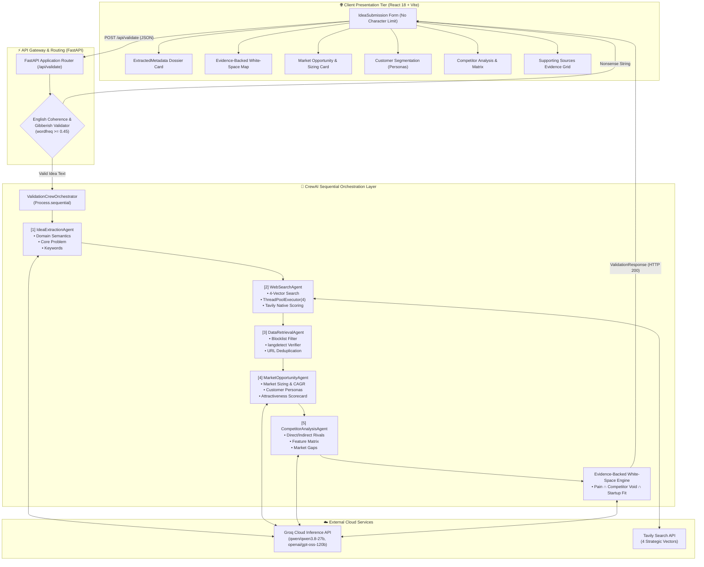

# 🏛️ System Architecture Document — Startup Idea Research Engine (Milestone 2)

## 1. Executive Summary & System Overview

The **Startup Idea Validator** platform is an autonomous multi-agent research engine that transforms unstructured, arbitrary-length early-stage startup ideas into structured market intelligence. 

Founders and product teams frequently struggle with subjective bias and tedious manual research when evaluating new concepts. The platform automates market validation through a 5-agent sequential pipeline:
1. **Structuring Idea Semantics:** Using LLM reasoning to infer product identity, domain vertical, audience profile, core customer pain points, and contextual keywords from natural language descriptions without artificial character limits.
2. **Executing Multi-Dimensional Market Research:** Orchestrating targeted web searches across four distinct strategic vectors via the **Tavily Search API**:
   - **Competitors & Alternatives:** Surfacing direct rivals, incumbent platforms, and substitute solutions.
   - **Industry News & Trends:** Tracking fresh market dynamics, regulatory shifts, and recent startup activity.
   - **Customer Demand & Problem Signals:** Gathering real-world pain points, feature requests, and user dissatisfaction signals.
   - **Market Size & Growth Forecasts:** Extracting CAGR metrics, total addressable market (TAM) valuations, and analyst projections.
3. **Filtering & Verification:** Cleansing raw content, deduplicating records, verifying language coherence, and ranking by native relevance scores.
4. **Market Opportunity Sizing & Customer Segmentation:** Analyzing empirical search data to extract market size estimates (global/regional/niche), CAGR growth trends, customer personas (end users vs decision makers, pain points, motivations, buying behaviors), and market attractiveness scorecards.
5. **Competitor Discovery & Comparison Matrix:** Classifying direct, indirect, and emerging rivals, building feature comparison matrices, and identifying pricing/business-model gaps.
6. **Evidence-Backed Market White-Space Engine:** Triangulating Customer Pain, Competitor Omissions, and Startup Capabilities into high-conviction opportunity gaps with traceable source citations.

---

## 2. End-to-End System Architecture



---

## 3. Sequential Agent Execution Flow & Explicit Logging

The backend stdout prints standardized milestone markers:
```
[1] Idea Extraction started
[1] Idea Extraction completed

[2] Web Search started
[2] Web Search completed

[3] Data Retrieval started
[3] Data Retrieval completed

[4] Market Opportunity Analysis started
[4] Market Opportunity Analysis completed

[5] Competitor Analysis started
[5] Competitor Analysis completed

[WhiteSpaceEngine] Correlating customer pain, competitor coverage, and startup capabilities...
[WhiteSpaceEngine] White-space opportunities synthesized successfully.
```

---

## 4. Multi-Dimensional Component Specifications

### 4.1 `IdeaExtractionAgent`
- Ingests raw startup descriptions of arbitrary length and optional user parameters (product name, industry vertical, target audience).
- Extracts clean domain keywords, normalized industry category, audience profile, and refined core problem statement using Groq inference with cascading model failovers.

### 4.2 `WebSearchAgent`
- Dispatches 4 concurrent search threads across:
  - **Competitors**: `{keywords} [{product_name}] competitors alternatives` (`search_depth="advanced"`)
  - **Industry News**: `{keywords} industry trends startup news` (`topic="news"`)
  - **Customer Demand**: `{keywords} customer problems user demand reviews` (`search_depth="advanced"`)
  - **Market Size & Trends**: `{keywords} [{industry}] market size growth forecast` (`search_depth="advanced"`)

### 4.3 `DataRetrievalAgent`
- Filters generic dictionaries, encyclopedias, and non-commercial portals (`BLOCKED_DOMAINS`).
- Seeded language verification (`langdetect`) rejects non-English noise.
- Canonical URL deduplication guarantees zero duplicate sources across all categories.
- Ranks sources descending by native semantic relevance score.

### 4.4 `MarketOpportunityAgent`
- Synthesizes verified search sources to estimate market size valuations (global, regional, or niche).
- Extracts CAGR trajectories, growth drivers, and demand signals.
- Constructs granular customer segments with explicit distinctions between **End Users** and **Decision Makers**, acute pain points, motivations, buying behaviors, and industry jargon.
- Evaluates Market Attractiveness across Demand Strength, Growth Strength, Customer Urgency, and Accessibility.
- Strict anti-hallucination: every quantitative figure links to a source URL; conflicting sources are explicitly documented.

### 4.5 `CompetitorAnalysisAgent`
- Discovers and categorizes direct rivals, indirect substitutes, and emerging startups.
- Evaluates core offerings, features, pricing (marked "unavailable" if undisclosed), business models, strengths, weaknesses, and documented customer complaints.
- Generates a multidimensional comparison matrix evaluating the startup against key competitors.
- Uncovers market gaps, pricing voids, and unmet customer needs.

### 4.6 `WhiteSpaceEngine` (Core Novelty)
- Computes deterministic opportunity intersections:
  $$\text{White-Space Opportunity} = \text{Customer Pain} \cap \text{Competitor Void} \cap \text{Startup Capability}$$
- Generates 2–4 high-conviction opportunity gaps with evidence strength ratings (High/Medium/Low), confidence percentages, differentiation hypotheses, and traceable citations.

---

## 5. Security, Reliability & Performance

1. **Environment Variable Security**: All API keys (`GROQ_API_KEY`, `TAVILY_API_KEY`) reside exclusively in server environments.
2. **Cascading Model Resilience**: Groq LLM inference automatically cascades across models (`qwen/qwen3.8-27b` $\rightarrow$ `openai/gpt-oss-120b` $\rightarrow$ `openai/gpt-oss-20b` $\rightarrow$ `allam-2-7b` $\rightarrow$ `groq/compound` $\rightarrow$ `groq/compound-mini`) with exponential backoff on HTTP 429.
3. **Optimized Token Budgets**: Evidence digests passed to LLM agents are dynamically pruned to top-ranking sources with concise excerpt slices, keeping prompt sizes under 2,000 tokens for sub-second responses.
4. **Fault Tolerance**: If any sub-task encounters partial or missing upstream data, deterministic analytical fallbacks synthesize baseline findings without breaking the API pipeline.

---

## 6. End-to-End Evaluation & Regression Suite

The platform includes an automated 3-industry benchmark harness in [`backend/scripts/test_milestone2_e2e.py`](backend/scripts/test_milestone2_e2e.py):
1. **Healthcare**: `ClinicGuard AI` (Patient No-Show Predictor & Intervention System)
2. **Climate / Agriculture**: `FarmOptima` (Smallholder Crop, Irrigation, and Market Pricing Decision Platform)
3. **Fintech / Education**: `CampusFin` (Student Spending Analytics & Personalized Financial Literacy Platform)

All three test prompts execute end-to-end through the complete 5-agent pipeline, producing full dossiers with verified source citations.
