# 12. Complete Mermaid Diagrams Reference (All 13 Diagrams)

This document contains all **13 professional, editable Mermaid diagrams** modeling the Startup Idea Validator system. Evaluators and students can copy and edit these diagram blocks directly in GitHub, Mermaid Live Editor, or presentation tools.

---

## 📑 Diagram Index
1. [System Architecture Diagram](#1-system-architecture-diagram)
2. [Use Case Diagram](#2-use-case-diagram)
3. [Data Flow Diagram (DFD) — Level 0](#3-dfd-level-0-context-level)
4. [Data Flow Diagram (DFD) — Level 1](#4-dfd-level-1-detailed-pipeline)
5. [Activity Diagram](#5-activity-diagram-process-flow)
6. [Sequence Diagram](#6-sequence-diagram-end-to-end-runtime)
7. [Entity-Relationship (ER) Diagram](#7-entity-relationship-er-diagram)
8. [AI Evaluation Pipeline Diagram](#8-ai-evaluation-pipeline-diagram)
9. [AI / Multi-Agent Architecture Diagram](#9-ai--multi-agent-architecture-diagram)
10. [API Architecture Diagram](#10-api-architecture-diagram)
11. [Deployment Architecture Diagram](#11-deployment-architecture-diagram)
12. [Component Diagram](#12-component-diagram)
13. [Class Diagram](#13-class-diagram-python-backend)

---

## 1. System Architecture Diagram

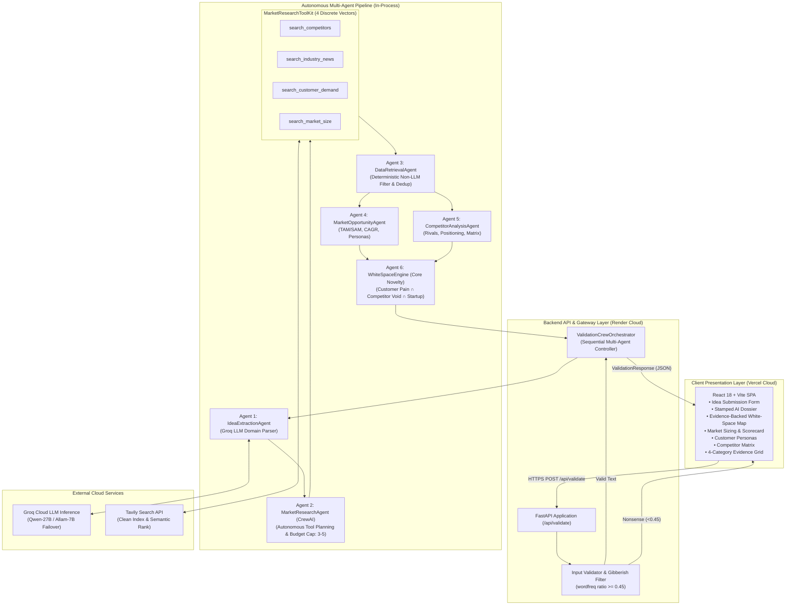

---

## 2. Use Case Diagram

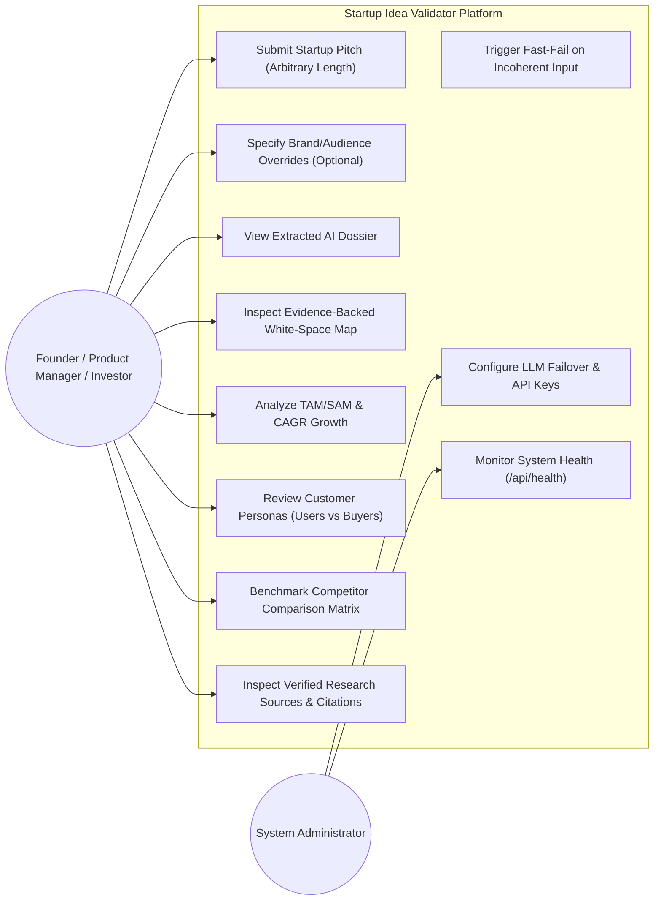

---

## 3. DFD Level 0 (Context Level)

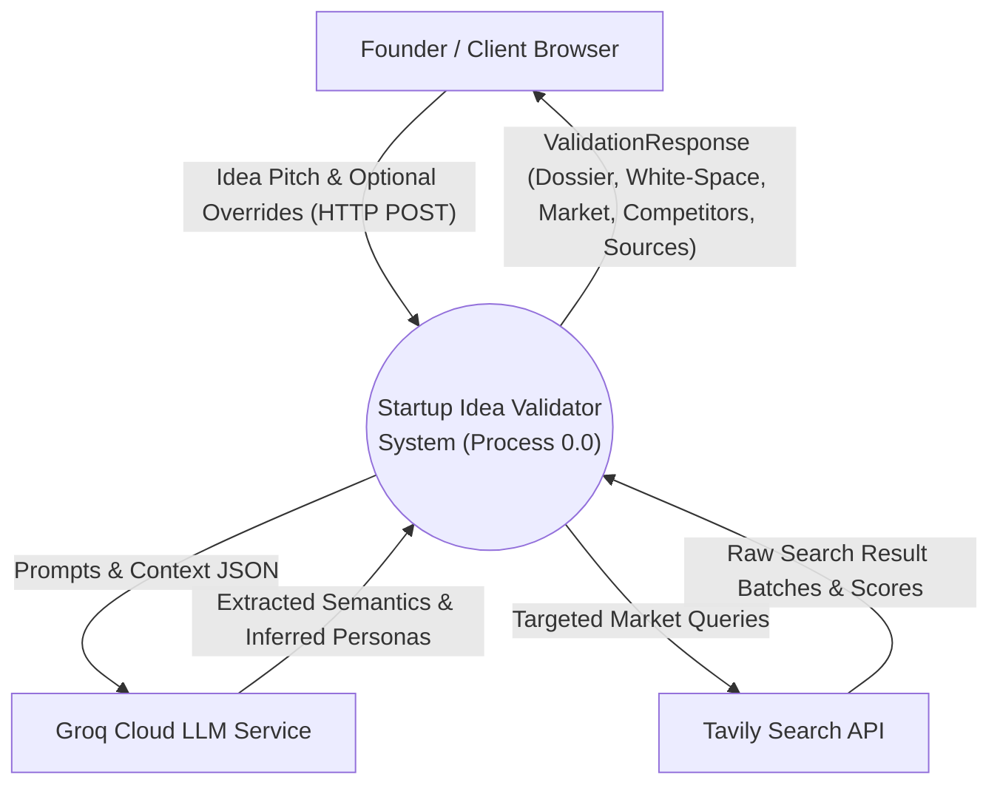

---

## 4. DFD Level 1 (Detailed Pipeline)

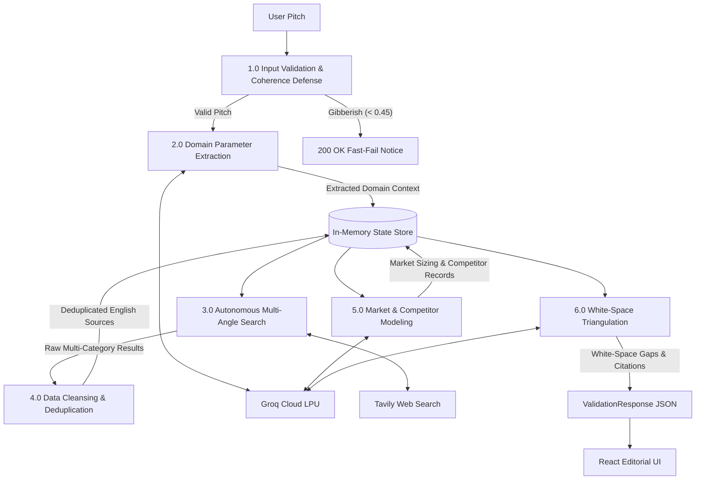

---

## 5. Activity Diagram (Process Flow)

```mermaid
flowchart TD
    Start([User Submits Pitch]) --> CheckInput{Input >= 5 Chars?}
    CheckInput -- No --> Err422[Return HTTP 422 Error]
    CheckInput -- Yes --> CheckGibberish{wordfreq Ratio >= 0.45?}
    
    CheckGibberish -- No (<0.45) --> FastFail[Fast-Fail in <0.01s with Friendly Guidance]
    FastFail --> RenderEmpty[Render Empty Case State]
    
    CheckGibberish -- Yes --> CallIdeaExtraction[Agent 1: Extract Domain Parameters via Groq]
    
    CallIdeaExtraction --> LLMFailover{Groq Primary Succeeded?}
    LLMFailover -- 429 Rate Limit --> BackupModel[Failover to allam-2-7b / compound-mini]
    LLMFailover -- Success --> PlanSearch[Agent 2: CrewAI Autonomous Search Planning]
    BackupModel --> PlanSearch
    
    PlanSearch --> ExecuteTools[Execute 3-5 Search Queries via Tavily]
    ExecuteTools --> RepetitionCheck{Near-Duplicate Query?}
    RepetitionCheck -- Yes --> SkipRepetition[Repetition Notice: Skip Repeat Call]
    RepetitionCheck -- No --> FetchTavily[Fetch Live Search Results]
    SkipRepetition --> CheckBudget{Budget (3-5) Reached?}
    FetchTavily --> CheckBudget
    
    CheckBudget -- No --> PlanSearch
    CheckBudget -- Yes --> Agent3Sanitize[Agent 3: Blocklist Filter, langdetect, Canonical Dedup]
    
    Agent3Sanitize --> ParallelAnalysis[Run Downstream Analysis]
    
    subgraph DownstreamAnalysis["Downstream Reasoning"]
        Agent4Market[Agent 4: Market Opportunity & Personas]
        Agent5Comp[Agent 5: Competitor Mapping & Matrix]
    end
    
    ParallelAnalysis --> DownstreamAnalysis
    DownstreamAnalysis --> CheckMarketSize{Market Sources > 0?}
    CheckMarketSize -- No --> HonestNull[Clamp Confidence = Null, Suppress Scorecard]
    CheckMarketSize -- Yes --> PopulateMarket[Populate TAM/SAM & Attractiveness]
    
    HonestNull --> Agent6WhiteSpace[Agent 6: WhiteSpaceEngine Triangulation]
    PopulateMarket --> Agent6WhiteSpace
    
    Agent6WhiteSpace --> AssembleResponse[Assemble ValidationResponse Contract]
    AssembleResponse --> RenderDashboard([Render React 18 Dynamic Editorial View])
```

---

## 6. Sequence Diagram (End-to-End Runtime)

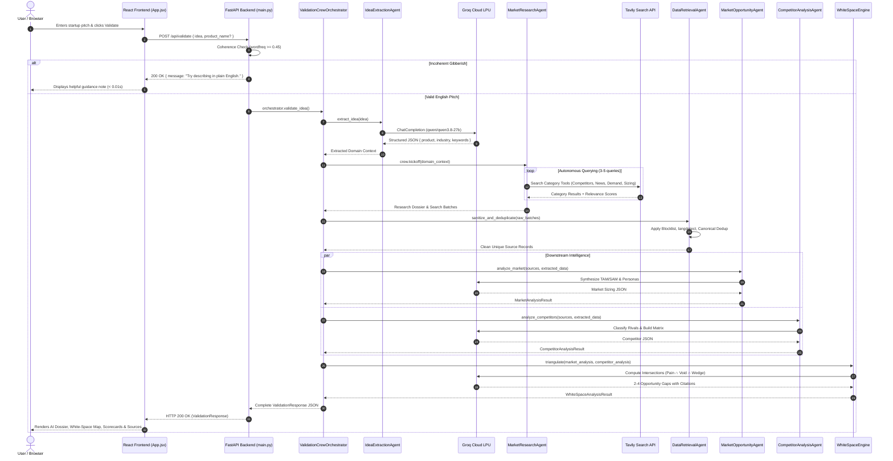

---

## 7. Entity-Relationship (ER) Diagram

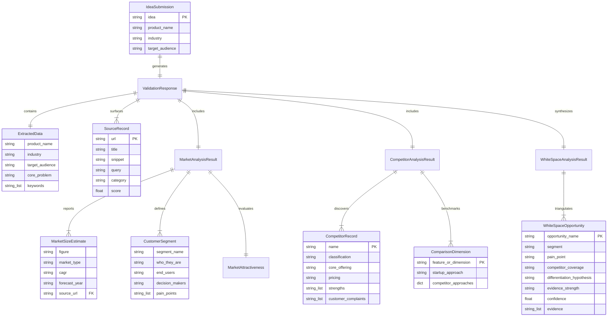

---

## 8. AI Evaluation Pipeline Diagram

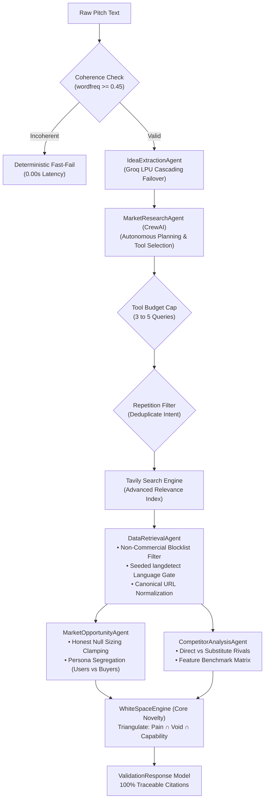

---

## 9. AI / Multi-Agent Architecture Diagram

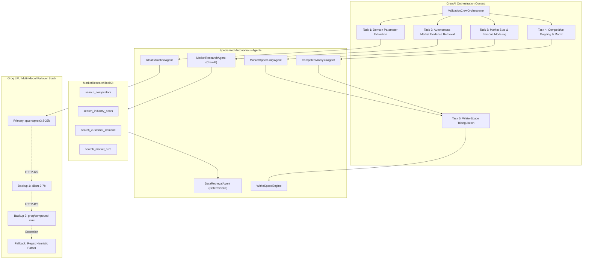

---

## 10. API Architecture Diagram

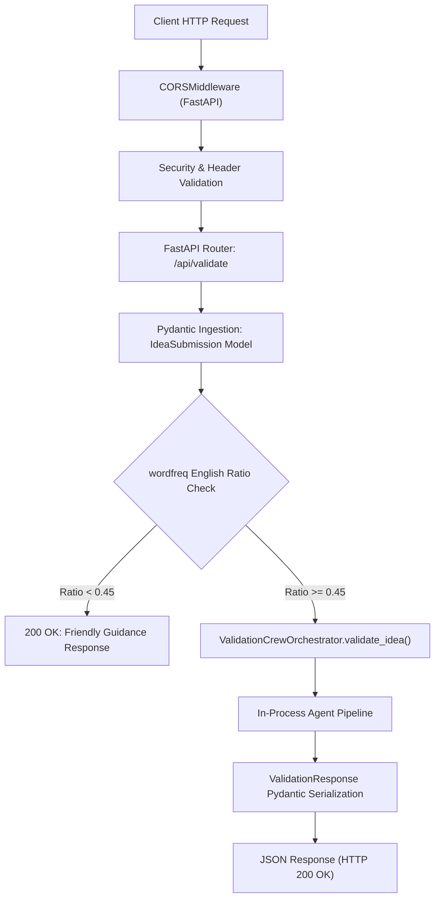

---

## 11. Deployment Architecture Diagram

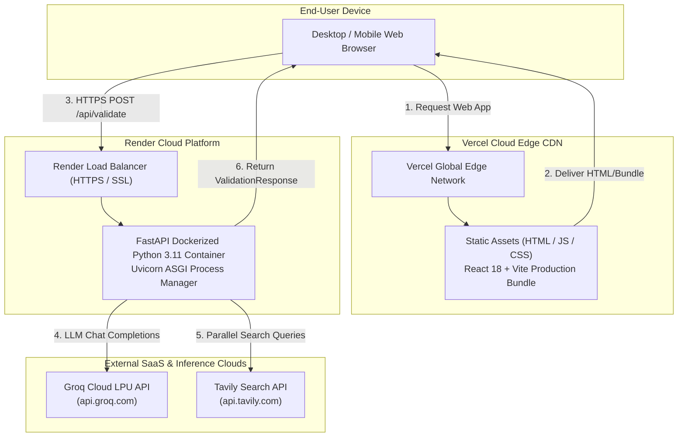

---

## 12. Component Diagram

```mermaid
graph TD
    subgraph FrontendComponents["Frontend Components (frontend/src/components)"]
        App["App.jsx (Main Orchestrator)"]
        Header["Header.jsx (Hero Masthead)"]
        Metadata["ExtractedMetadata.jsx (Dossier Card)"]
        WhiteSpace["WhiteSpaceAnalysis.jsx (White-Space Map)"]
        Market["MarketOpportunity.jsx (TAM/SAM Sizing)"]
        Personas["CustomerSegments.jsx (Persona Cards)"]
        Competitors["CompetitorAnalysis.jsx (Matrix)"]
        Summary["ResultsSummary.jsx (Count-up Stats)"]
        Category["CategorySection.jsx (Evidence Grid)"]
        Source["SourceCard.jsx (Snippet Sanitizer)"]
    end

    subgraph BackendModules["Backend Modules (backend/)"]
        Main["main.py (FastAPI App)"]
        Orchestrator["crew/orchestrator.py"]
        CrewAgents["crew/agents.py"]
        CrewTasks["crew/tasks.py"]
        CrewTools["crew/tools.py"]
        
        AgentExtraction["agents/idea_extraction_agent.py"]
        AgentSearch["agents/web_search_agent.py"]
        AgentRetrieval["agents/data_retrieval_agent.py"]
        AgentMarket["agents/market_analysis_agent.py"]
        AgentComp["agents/competitor_analysis_agent.py"]
        
        ServiceLLM["services/llm_service.py"]
        ServiceWhiteSpace["services/white_space_engine.py"]
        ServiceText["services/text_utils.py"]
        
        Schemas["schemas/validation_schemas.py"]
    end

    App --> Header & Metadata & WhiteSpace & Market & Personas & Competitors & Summary & Category
    Category --> Source

    App -.->|HTTP POST| Main
    Main --> Schemas
    Main --> Orchestrator
    Orchestrator --> CrewAgents & CrewTasks & CrewTools
    Orchestrator --> AgentExtraction & AgentRetrieval & AgentMarket & AgentComp & ServiceWhiteSpace
    
    AgentExtraction & AgentMarket & AgentComp & ServiceWhiteSpace --> ServiceLLM
    AgentMarket & ServiceWhiteSpace --> ServiceText
    CrewTools --> AgentSearch
```

---

## 13. Class Diagram (Python Backend)

```mermaid
classDiagram
    class IdeaSubmission {
        +str idea
        +Optional[str] product_name
        +Optional[str] industry
        +Optional[str] target_audience
    }

    class ValidationResponse {
        +str idea
        +ExtractedData extracted_data
        +List[SourceRecord] sources
        +MarketAnalysisResult market_analysis
        +CompetitorAnalysisResult competitor_analysis
        +WhiteSpaceAnalysisResult white_space_analysis
        +Dict summary
    }

    class IdeaExtractionAgent {
        -List[str] MODEL_CASCADE
        +extract(idea: str, product_name: Optional[str]) ExtractedData
        -_call_groq_with_failover(prompt: str) Dict
        -_fallback_extraction(idea: str) ExtractedData
    }

    class MarketResearchToolKit {
        +search_competitors(query: str) str
        +search_industry_news(query: str) str
        +search_customer_demand(query: str) str
        +search_market_size(query: str) str
        -record_search(category: str, query: str) bool
    }

    class DataRetrievalAgent {
        +List[str] BLOCKED_DOMAINS
        +structure(raw_batches: Dict) Tuple
        -_is_clean_url(url: str) bool
        -_is_english(text: str) bool
        -_canonical_url(url: str) str
    }

    class MarketOpportunityAgent {
        +analyze(sources: List, extracted_data: Dict) MarketAnalysisResult
        -_extract_market_sizing(sources: List) List[MarketSizeEstimate]
        -_extract_personas(sources: List) List[CustomerSegment]
        -_fallback_analysis(sources: List) MarketAnalysisResult
    }

    class CompetitorAnalysisAgent {
        +analyze(sources: List, extracted_data: Dict) CompetitorAnalysisResult
        -_classify_competitors(sources: List) List[CompetitorRecord]
        -_build_matrix(competitors: List) List[ComparisonDimension]
        -_fallback_analysis(sources: List) CompetitorAnalysisResult
    }

    class WhiteSpaceEngine {
        +triangulate(market_analysis: MarketAnalysisResult, competitor_analysis: CompetitorAnalysisResult) WhiteSpaceAnalysisResult
        -_correlate_intersections(pain_points: List, competitor_voids: List) List
        -_fallback_whitespace() WhiteSpaceAnalysisResult
    }

    class ValidationCrewOrchestrator {
        -IdeaExtractionAgent idea_agent
        -DataRetrievalAgent retrieval_agent
        -MarketOpportunityAgent market_agent
        -CompetitorAnalysisAgent competitor_agent
        -WhiteSpaceEngine white_space_engine
        +validate_idea(submission: IdeaSubmission) ValidationResponse
        -_run_crew_market_research(domain_data: Dict) Dict
    }

    ValidationCrewOrchestrator --> IdeaExtractionAgent
    ValidationCrewOrchestrator --> MarketResearchToolKit
    ValidationCrewOrchestrator --> DataRetrievalAgent
    ValidationCrewOrchestrator --> MarketOpportunityAgent
    ValidationCrewOrchestrator --> CompetitorAnalysisAgent
    ValidationCrewOrchestrator --> WhiteSpaceEngine
    ValidationCrewOrchestrator ..> IdeaSubmission
    ValidationCrewOrchestrator ..> ValidationResponse
```
