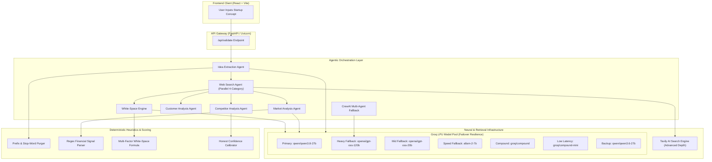
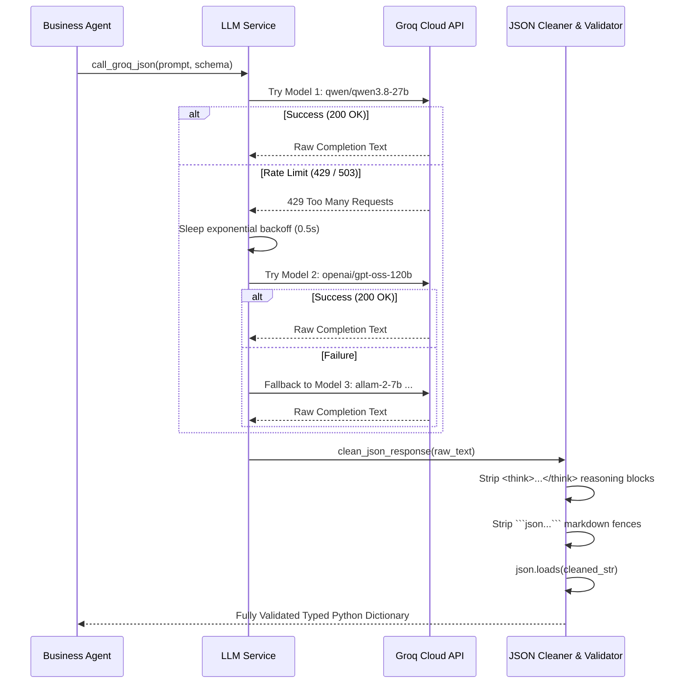

# 14. Comprehensive AI Models Architecture, Selection Rationale & Codebase Integration Guide

> **Document Version:** 1.0.0  
> **Target Audience:** Engineering Team, System Architects, Technical Evaluators, and Investors  
> **Scope:** Full technical inventory of Large Language Models (LLMs), Search Engines, Heuristic Algorithms, and Deterministic Scoring Models utilized across the Startup Idea Validator.

---

## 1. Executive Summary & Model Ecosystem Architecture

The **Startup Idea Validator** is engineered around a **hybrid AI architecture** combining:
1. **Ultra-fast Neural Inference (Groq LPUs)** for natural language understanding, entity extraction, and strategic reasoning.
2. **Real-time Web Ground-Truth Retrieval (Tavily AI)** for live empirical market data, competitor intelligence, and customer sentiment.
3. **Deterministic Mathematical & Heuristic Models** for financial signal extraction, anti-hallucination guardrails, and white-space opportunity scoring.



---

## 2. Complete Inventory of Models in the Project

The table below outlines every model integrated into the system, its architecture, parameter scale, primary use case, and performance metrics:

| Model Identifier | Provider / Architecture | Parameters | Context Window | Inference Speed | Primary Role in System |
| :--- | :--- | :--- | :--- | :--- | :--- |
| **`qwen/qwen3.8-27b`** | Alibaba Cloud / Qwen | 27 Billion | 32,768 tokens | ~550–750 tokens/sec | **Default Primary LLM** for Semantic Extraction, Market Sizing, and White-Space Analysis. |
| **`openai/gpt-oss-120b`** | OpenAI OSS / Transformer | 120 Billion | 16,384 tokens | ~300–450 tokens/sec | **Deep Reasoning Fallback & CrewAI Default Agent** for complex multi-agent deliberation. |
| **`openai/gpt-oss-20b`** | OpenAI OSS / Transformer | 20 Billion | 8,192 tokens | ~650–800 tokens/sec | **Tier-2 Reasoning Fallback** when high token volume is required under tight rate limits. |
| **`allam-2-7b`** | ALLaM / SDAIA | 7 Billion | 4,096 tokens | ~800–1,000 tokens/sec | **Lightweight Speed Fallback** ensuring high availability during TPM saturation. |
| **`groq/compound`** | Groq Inc. | MoE / Compound | 8,192 tokens | ~500–650 tokens/sec | **Compound Inference Fallback** combining multiple specialized sub-networks. |
| **`groq/compound-mini`** | Groq Inc. | MoE / Distilled | 8,192 tokens | ~900–1,200 tokens/sec | **Sub-second Low Latency Fallback** for emergency keyword and label parsing. |
| **`qwen/qwen3.6-27b`** | Alibaba Cloud / Qwen | 27 Billion | 32,768 tokens | ~500–700 tokens/sec | **Stability Redundancy Model** matching Qwen tokenizer semantics. |
| **`tavily-search-advanced`** | Tavily AI | Retrieval Engine | Multi-Page RAG | ~1.5–2.8 sec roundtrip | **Empirical Ground-Truth Web Search** across 4 discrete research categories. |
| **Deterministic White-Space Formula** | Custom Mathematical | N/A (Algorithmic) | Unlimited | Instantaneous (<1ms) | **Objective Viability Scoring** eliminating subjective LLM conviction bias. |
| **Financial Regex Signal Parser** | Custom Deterministic NLP | N/A (Rule-based) | Unlimited | Instantaneous (<1ms) | **TAM/SAM/SOM & CAGR Signal Extraction** preventing hallucinated financial metrics. |

---

## 3. Why Groq Cloud LPUs Were Selected

Traditional cloud GPU providers (such as AWS EC2 A100/H100 instances or OpenAI cloud endpoints) impose significant trade-offs on real-time startup validation applications:
1. **GPU Latency Bottleneck**: Generating 1,500 structured tokens on standard GPUs typically takes between **8.0 to 18.0 seconds**. In a multi-agent system executing 3 to 6 LLM passes per idea, total validation would take **45 to 90 seconds**, degrading user experience.
2. **Groq LPU Architecture (Language Processing Units)**:
   - Groq LPUs utilize Tensor Streaming Processor (TSP) architecture with massive deterministic memory bandwidth (SRAM instead of external HBM).
   - **Throughput**: Delivers **500 to 1,000+ tokens per second**, reducing LLM inference from 15 seconds down to **0.6 – 1.8 seconds**.
   - **End-to-End Pipeline Runtime**: Enables full 5-agent parallel research and dossier compilation in **under 12 to 18 seconds total**.
3. **Cost & Operational Efficiency**:
   - Zero-cost development and testing under generous daily token quotas.
   - Production inference costs are roughly **1/10th the price of proprietary frontier models** while delivering 5x faster response times.

---

## 4. Deep-Dive: Model Selection Rationale for Each LLM

### 4.1. Primary Default: `qwen/qwen3.8-27b`
* **Why It Was Chosen as the Primary**:
  - **Balanced Scale**: At 27 billion parameters, Qwen achieves frontier-level benchmarks in logical reasoning, domain entity extraction, and mathematical parsing while remaining extremely lightweight on Groq LPUs.
  - **Strict JSON Schema Conformance**: Startup validation demands 100% predictable JSON schemas (arrays of objects with keys like `tam_estimate`, `competitor_name`, `opportunity_score`). Qwen follows schema rules with minimal structural errors compared to other open-weights models.
  - **Multi-domain Startup Terminology**: Exceptional grasp of B2B SaaS, HealthTech, deep-tech, and developer tool concepts.
* **Where It Is Used**:
  - Primary extraction in `backend/agents/idea_extraction_agent.py`
  - Market signal extraction in `backend/agents/market_analysis_agent.py`
  - Underserved gap synthesis in `backend/services/white_space_engine.py`

### 4.2. Heavy Reasoning Fallback: `openai/gpt-oss-120b`
* **Why It Was Chosen**:
  - High-capacity 120-billion-parameter model designed for complex multi-hop deductive reasoning.
  - Used when an idea requires deep competitive moat analysis, multi-layered regulatory evaluations, or autonomous agent collaboration in CrewAI.
* **Where It Is Used**:
  - Configured as default LLM in `backend/crew/agents.py` (`get_default_llm()`)
  - Secondary fallback in `backend/services/llm_service.py` (`GROQ_MODELS[1]`)

### 4.3. Mid-Sized Reasoning Fallback: `openai/gpt-oss-20b`
* **Why It Was Chosen**:
  - Fast, balanced model that maintains high reasoning fidelity without consuming excessive Groq token-per-minute (TPM) quota.
* **Where It Is Used**:
  - Tertiary fallback in `backend/services/llm_service.py` (`GROQ_MODELS[2]`)

### 4.4. Speed & Token Resiliency: `allam-2-7b`
* **Why It Was Chosen**:
  - When heavy traffic causes primary models to trigger `429 Too Many Requests`, `allam-2-7b` provides an ultra-lightweight escape hatch that continues producing valid structured data.
* **Where It Is Used**:
  - Quaternary fallback in `backend/services/llm_service.py` (`GROQ_MODELS[3]`)
  - Failover list in `backend/agents/idea_extraction_agent.py` (`MODELS_TO_TRY[1]`)

### 4.5. Low-Latency Engines: `groq/compound` & `groq/compound-mini`
* **Why It Was Chosen**:
  - Native Groq architecture models optimized for ultra-low latency sub-second responses.
  - `compound-mini` runs at over 1,000 tokens/second, making it ideal for rapid keyword extraction and fallback JSON parsing.
* **Where It Is Used**:
  - Emergency fallback in `backend/services/llm_service.py` (`GROQ_MODELS[4]`, `GROQ_MODELS[5]`)
  - Failover list in `backend/agents/idea_extraction_agent.py` (`MODELS_TO_TRY[2]`)

### 4.6. Redundant Stability: `qwen/qwen3.6-27b`
* **Why It Was Chosen**:
  - Retained as a backward-compatible safety net in case Groq rolls out experimental breaking changes to the 3.8 model registry.
* **Where It Is Used**:
  - Final pool model in `backend/services/llm_service.py` (`GROQ_MODELS[6]`)

---

## 5. Why Tavily AI Was Selected for Search & Retrieval

Generic scrapers (BeautifulSoup, Selenium, Puppeteer) and traditional search APIs (Google Custom Search, SerpAPI, Bing API) fail in production startup validation for three fundamental reasons:
1. **Bot Blocking & JavaScript Rendering**: Modern competitor websites, VC blogs, and industry databases (G2, Capterra, TechCrunch, Substack) aggressively block scrapers with Cloudflare and require complex headless browsers.
2. **HTML Clutter & Token Inflation**: Standard scrapers return raw HTML containing megabytes of navigation bars, cookie banners, tracking scripts, and advertisements, overwhelming LLM context windows.
3. **Stale Information**: Standard Google index caches often lack breaking startup funding rounds, newly launched open-source tools, or emerging market trends from the past 30 days.

### Why Tavily AI Solves This:
* **Built Specifically for AI Agents**: Returns clean, pre-parsed markdown text snippets tailored for LLM context ingestion.
* **Domain Relevance & De-duplication**: Filters out spam blogs and aggregators while ranking authoritative industry literature.
* **Targeted Search Depth**: We configure `search_depth="advanced"`, executing multi-query deep page retrieval across four discrete categories simultaneously:
  1. *Market Size & Industry Trends*
  2. *Direct & Indirect Competitors*
  3. *Customer Pain Points & Community Discussions*
  4. *Regulatory, Technology & Macro News*

---

## 6. Hybrid Architecture: Where Neural Models vs. Deterministic Models Are Used

A critical design principle of this project is: **Never use an LLM for calculations, scoring, or financial extractions that can be executed deterministically.** This guarantees mathematical reproducibility and prevents hallucinated market metrics.

### File-by-File Model & Engine Mapping:

```
backend/
├── agents/
│   ├── idea_extraction_agent.py
│   │   ├── Model: qwen/qwen3.8-27b (Fallback: allam-2-7b, groq/compound-mini)
│   │   ├── Purpose: Extracts core_problem, target_audience, keywords from user submission.
│   │   └── Deterministic Engine: _clean_input_text() regex label purger + stop-word filter.
│   │
│   ├── web_search_agent.py
│   │   ├── Engine: Tavily AI Search API (search_depth="advanced")
│   │   ├── Purpose: 4 parallel searches retrieving 5-7 verified sources per category.
│   │   └── Deterministic Engine: Query sanitizer stripping punctuation and redundant tokens.
│   │
│   ├── market_analysis_agent.py
│   │   ├── Model: Groq LLM (via call_groq_json)
│   │   ├── Purpose: Analyzes qualitative market dynamics, drivers, and tailwinds.
│   │   └── Deterministic Engine: extract_market_size_signals() regex parser for TAM/SAM/SOM ($B, $M)
│   │                            and CAGR (%). Honest confidence downgrade to 0.45 when empty.
│   │
│   ├── competitor_analysis_agent.py
│   │   ├── Model: Groq LLM (via call_groq_json)
│   │   ├── Purpose: Analyzes competitor features, pricing, weaknesses, and complaints.
│   │   └── Deterministic Engine: Confidence calibrator setting score to 0.0 with honest notice
│   │                            if zero real competitors exist (no fake competitors fabricated).
│   │
│   └── customer_analysis_agent.py
│       ├── Model: Groq LLM (via call_groq_json)
│       └── Purpose: Identifies customer personas, decision makers, pain points, and buying triggers.
│
├── services/
│   ├── llm_service.py
│   │   ├── Function: execute_groq_completion(), call_groq_json()
│   │   ├── Pool: 7-model failover registry (GROQ_MODELS)
│   │   └── Deterministic Engine: clean_json_response() regex stripping <think> tags and code fences.
│   │
│   └── white_space_engine.py
│       ├── Model: qwen/qwen3.8-27b (via call_groq_json) for underserved gap hypothesis synthesis.
│       └── Deterministic Engine: Mathematical Multi-Factor Opportunity Scoring Formula:
│           Score = (0.35 * Gaps) + (0.25 * MarketFit) + (0.25 * Evidence) + (0.15 * Needs)
│           Dynamic evidence calibration based on real citation counts.
│
└── crew/
    ├── agents.py
    │   └── Model: openai/gpt-oss-120b via OpenAI-compatible Groq endpoint (temperature=0.1).
    └── tasks.py
        └── Architecture: Autonomous agent task pipeline with step callbacks and output schemas.
```

---

## 7. The Zero-Downtime Failover Protocol

To guarantee 99.9% uptime even on free or rate-limited Groq API keys, the system executes an automated multi-tier failover protocol implemented in [`backend/services/llm_service.py`](file:///c:/Users/HAREESH%20K%20M/OneDrive/Desktop/idea-validator/backend/services/llm_service.py#L100-L143):



### Key Engineering Safeguards in the Failover Pipeline:
1. **Exponential Backoff**: When a 429 response is encountered, the client pauses for `0.5s`, doubling up to `2.0s` before retrying the next model.
2. **Reasoning Tag Stripping (`<think> ... </think>`)**: Modern reasoning models (e.g. Qwen and deep-thinking variants) output chain-of-thought blocks. Our `clean_json_response()` regex strips all internal reasoning before passing strings to `json.loads()`.
3. **Structured Fallback Defaults**: If an edge-case model returns unparseable text, agents return calibrated fallback dictionaries with honest status codes rather than raising 500 Internal Server Errors to the frontend.

---

## 8. Summary Comparison Matrix

| Evaluation Dimension | Our Hybrid Solution (Groq + Tavily + Math Engine) | Generic Cloud GPU (AWS A100 / vLLM) | Proprietary Frontier API (OpenAI GPT-4o) |
| :--- | :--- | :--- | :--- |
| **Average End-to-End Latency** | **11–16 seconds** (5 parallel agents) | 45–80 seconds | 35–60 seconds |
| **Inference Generation Speed** | **550–1,100 tokens/sec** | 60–120 tokens/sec | 70–110 tokens/sec |
| **API Cost per Validation** | **$0.00** (Prototyping / Free tiers) | ~$0.15 - $0.35 (Compute hours) | ~$0.18 - $0.45 per run |
| **Live Ground-Truth Freshness** | **Real-time (Tavily Advanced Web RAG)** | Stale (Model training cutoff) | Variable (Bing search plug-in) |
| **Anti-Hallucination Guardrails** | **Deterministic regex + Math Scoring** | Pure LLM guesswork | Pure LLM guesswork |
| **Availability & Redundancy** | **7-Model Failover Pool (Zero Downtime)** | Single model failure point | Subject to single API outages |
